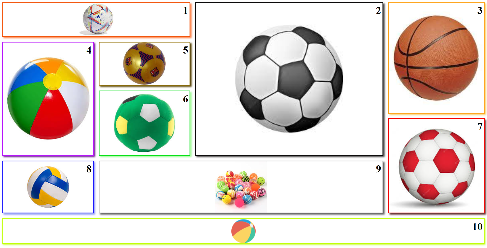

# Galeria de imágenes con grid
Probando grid, se me ocurrió la idea de crear una galeria de imágenes y al pasar el raton por encima tienen animaciones.
Creo que el grid tiene un gran potencial que hay que explotar al máximo.
## Screenshot

## GitHub flow
1 empleado entorno de trabajo remoto
2 de momento solo yo
3